# Hello, I'm Minwoo Kim 👋

> ### CS 전공 학부생이자, 다양한 기술을 활용하는 인프라 개발자를 지향합니다.

## 🌱 Currently Learning
- **CSE** at **Kyungpook National University** (KNU, 경북대학교)
- **AI Developer Track** — KT AIVLE School (9th Gen)

## 💼 Experience
- High Performance Computing Lab. — Undergraduate Intern
- Kakao Tech Campus 3rd Gen — Back-End Engineer · [Team6_BE](https://github.com/kakao-tech-campus-3rd-step3/Team6_BE)

## 🛠 Tech Stack

<strong>Core</strong>

  
  
  
  
  
  
  

<strong>Also work with</strong>

<table>
  <tr>
    <td valign="top">
      <strong>Languages</strong> 
      
      
      
      
    </td>
    <td valign="top">
      <strong>Data</strong> 
      
      
      
    </td>
  </tr>
  <tr>
    <td valign="top">
      <strong>Frameworks</strong> 
      
      
    </td>
    <td valign="top">
      <strong>Infra / DevOps</strong> 
      
      
      
      
      
    </td>
  </tr>
</table>

<strong>Tools · AI · Learning</strong>

<table>
  <tr>
    <td valign="top" colspan="2">
      <strong>Tools</strong> 
      
      
      
      
      
      
    </td>
  </tr>
  <tr>
    <td valign="top">
      <strong>AI</strong> 
      
      
      
    </td>
    <td valign="top">
      <strong>Learning</strong> 📖 
      
      
      
    </td>
  </tr>
</table>

## 🌍 Open Source
- **[nanocoai/nanoclaw](https://github.com/nanocoai/nanoclaw)** ⭐ 30k+ — OpenClaw 류의 경량 개인 비서 에이전트 (메시징 앱 연동 · 컨테이너 실행)
  - **프롬프트 엔지니어링** 관점에서, MCP 도구의 description(에이전트에게 주어지는 프롬프트)이 실제 동작과 모순되어 예약 작업 메시지가 **중복 전송**되던 문제를 분석·제보하고 직접 수정
  - 🐛 [Issue #728](https://github.com/nanocoai/nanoclaw/issues/728) → ✅ [PR #729 (merged)](https://github.com/nanocoai/nanoclaw/pull/729)

## 🔬 Research
- **Spiking Neural Network (TTFS-based)** @ High Performance Computing Lab. *(undergraduate intern)*
  - 실험 자료: [IT-Gentleman/TTFS-ET](https://github.com/IT-Gentleman/TTFS-ET)
  - 논문: [DBpia](https://www.dbpia.co.kr/journal/articleDetail?nodeId=NODE12042229) ([PDF](https://www.dbpia.co.kr/pdf/pdfView.do?nodeId=NODE12042229))
  - 한국정보과학회 **2024 한국소프트웨어종합학술대회(KSC 2024)** 학부생 부문 투고 — **학부생 부문 우수상 수상** 🏆

## 📊 GitHub

  
  

## 🧩 Problem Solving

## 📫 Reach Me
- gentleman at kakao.com
